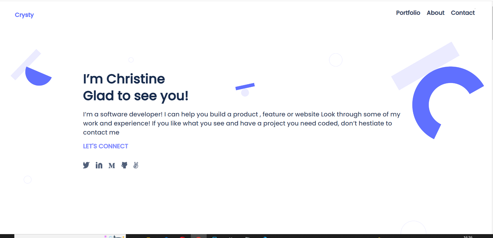

# porfolio Project

> Set up Personal Porfolio Project.


## Built With

- [x] Languages: HTML, CSS
- [x] Linters: Stylelint and ESLint
- [x] Code Editor: VS Code


## Screenshot 📸
  

## Live Demo 🔗

[live demo link](https://christabelle143.github.io/mobile-version/).👈

## Getting Started

To get a local copy up and running follow these simple steps.

### Prerequisites

- [x] A web browser like Google Chrome.
- [x] A code editor like Visual Studio Code with Git and Node.js.

You can check if Git is installed by running the following command in the terminal.
```
$ git --version
```

Likewise for Node.js and npm for package installation.
```
$ node --version && npm --version
```

### Setup

- Inorder to be able to set this up locally and eventually run it, follow the steps;
- Open your Gitbash or your code editor's terminal and run the command git clone git@github.com:Christabelle143/mobile-version.git
- Then you can pull the work from github to ur local machine using the git pull command.


### Run tests

To check for linters, use the files provided by [Microverse](https://github.com/microverseinc/linters-config). A GitHub action is also set to run during pull request.


## Author

👤 **Author**

- GitHub: [Christabelle143](https://github.com/Christabelle143)
- Twitter: [@christabelleyo](https://twitter.com/christabelleyo)
- LinkedIn: [YoutaChristabelle](https://linkedin.com/in/YoutaChristabelle)

## 🤝 Contributing

Contributions, issues, and feature requests are welcome!

Feel free to check the [issues page](https://github.com/Christabelle143/mobile-version/issues).


## Show your support

Give a ⭐️ if you like this project!

## Acknowledgments

- [Microverse](https://www.microverse.org/)
- Code Reviewers
- Coding Partners

## 📝 License

This project is [MIT](./MIT.md) licensed.
